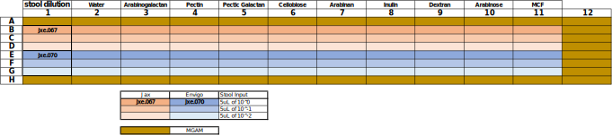

# Jax & Envigo Growth Kinetcs w/ MGAM supplemented w/  Polysaccharides
* Start Date : 2021-04-07
* End Date : 

## Purpose

## Background

## Protocol
### 2021-04-06
#### Preparing polysaccharides
* YH had a panel of ps's already prepared and stored @ -80C, all at 100mg/mL
    * Arabinogalactan
    * Pectin (Apple)
    * Pectic Galactan
    * D-(+)-Cellobiose
    * Arabinan

* Preparing Mouse Chow Filtrate (MCF) - [data sheet](./documents/5053_diet.pdf)
    * took 10g mouse chow 5053 from ICRC facility
    * Crushed 
    * Suspended in 25mL H2O (40% w/v)
    * spun down at 4300g for 30min
    * Pipetted off supernatant
    * passed thru .22um filter (steriflip)
    * aliquoted out in 1mL stocks 
    * stored at -20C

* Freezer storage
    * -20C box in my small -20 labeled "polysacharides" (it's spelled wrong)


### 2021-04-07
#### Finishing PS prep
* Prepared 100mg/mL Inulin
    * 1g in 10mL inulin from chicory
    * Vortexed thoroughly
    * Set in 55c inc for ~5min 
    * Filter w/ steriflip, .22uM
    * stored at -20C in PS box 

#### Preparing Kinetics Plate
* Sample Selection: d2 samples, 
    * jxe.067 -> jax_control, 0.0326g
    * jxe.070 -> envigo_control, 0.0316g
* Pulled to thaw
* According to plate layout


* Loading plate
    * aliqouted out 10uL of each sugar benchside
    * moved into anaerobic chamber
    * Added 185uL of reduced MGAM/2 to each well
    * Prepared dilutions of Jax/Envigo in empty wells (Column 1)
    * Added 5uL of Jax or Envigo input w/ multichannel

#### Running Kinetics
* Using the anaerobic chamber plate reader
* 37C, 30sec fast mix, read OD600

### 2021-04-09
#### Processing Results
* GU pulled raw data from plate reader - [](./data/)
* Pulled into tidy data w/ `extract_data.py`
```
python scripts/extract_data.py --input data/20210407_FMT_PolysaccharidePanel.txt \
                               --output data/data.csv
```

#### Exploratory Analysis
* Exploring data w/ jupyter notebook : [01_exploratory_analysis.ipynb](./jupyter/01_exploratory_analysis.ipynb)
* Translated notebook to [01_exploratory_analysis.R](./scripts/01_exploratory_analysis.R)


## Results

## Discussion

## Future Experiments