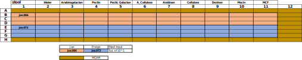

## Protocol
### 2021-10-12
#### Starting Kinetic Run
* GU started plate
* Same general set up as previous experiment
    * [2021-04-06_polysacc_growth_kinetics](../2021-04-06_polysacc_growth_kinetics)
* 32C, shake 30s before read, read every 10mins
* New layout


### 2021-10-14
#### Preparing Metadata / Data
* Created a new plate_layout - [plate_layout.xlsx](./metadata/plate_layout.xlsx)
* Created a new metadata sheet - [metadata.csv](./metadata/metadata.csv)
* Guillaume sent data - [20210412_FMT_PolysaccharidePanel.txt](./data/20210412_FMT_PolysaccharidePanel.txt)

#### Processing Raw Data
* Copied over [extract_data.py](./scripts/extract_data.py) from [2021-04-06_polysacc_growth_kinetics](../2021-04-06_polysacc_growth_kinetics)
* Ran the script to produce process outputs
```
python scripts/extract_data.py --input data/20210412_FMT_PolysaccharidePanel.txt \
                               --output data/data.csv
```

#### Visualizing Data
* Viz w/ [01_exploratory_analysis.R](./scripts/exploratory_analysis.R)


## Results


